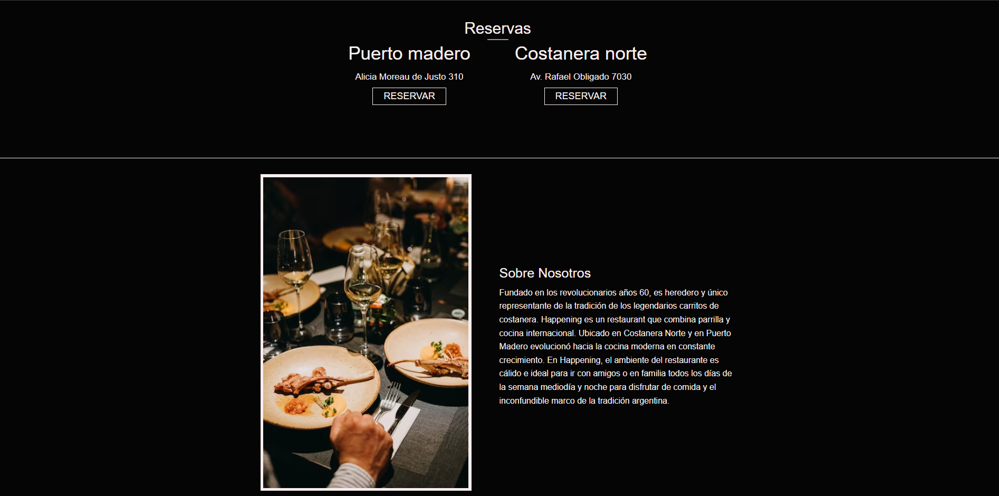
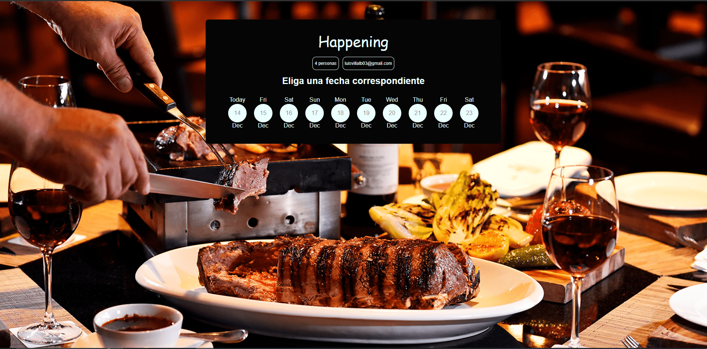

# Happening Restaurante argentino clone

En este proyecto he decidido hacer un clone de la parrila Happening.Esta contara con un sistema de reservar y cancelacion de la misma en caso de que se desee.



La tecnologias que utilize para llevar este proyecto a cabo son:

- [Laravel](https://laravel.com/)
- [PHP](https://www.php.net/)
- [Xampp](https://www.apachefriends.org/es/index.html)
- [MySQL](https://www.mysql.com/)
- [Git](https://git-scm.com/)

Para poder utilizar esta app es importante tener descargado Xampp, PHP y MySQl el cual sera nuestra base de datos.Asi como tambien tener instalado git para clonar el respositorio.

## Tabla de contenidos

- [Informacion](#informacion-sistema)
- [Comenzar](#comenzar)
- [Configuracion](#configuracion)
    -[Database](#db-config)
    -[Email](#email-config)
    -[Migration](#migration)

### informacion-sistema

Antes de comenzar queria contarles como va a funcionar por dentro este sitio web, este como se ha dicho contara con un sistema de reservas,el cual funcionara de la siguiente manera:

- En un mismo dia y mismo local se podran hacer hasta 16 reservas
- Los horarios de reservas seran las 20:00, 21:00, 22:00 y 23:00
- En un horario solo se podran hacer un maximo de 4 reservas
- La cantidad maxima de comensales sera de 4



### comenzar

Para comenzar lo primero que deberian de hacer es clonar este repositorio.Para ello deberan de ir a un carpeta de su computador,abrir su terminar y ejectuar el siguiente comando.

```bash
git clone "https://github.com/LuisVillalba1/RestauranteHappening"
```

------------

### configuracion

Para comenzar es importante realizar un par de configuraciones.Como dijimos esta app utilizara una base de datos MySQL asi como tambien utilizaremos un mail para enviar los datos de la reserva

#### db-config

Para configurar tu base de datos es importante irte a la rama principal del proyecto y crear un archivo que se llame ".env"

En esta tendras que crear las siguientes Claves

- DB_CONNECTION
- DB_HOST
- DB_PORT
- DB_DATABASE
- DB_USERNAME
- DB_PASSWORD

1. DB_CONNECTION: Seria el tipo de base de datos que utilizaremos, en este caso "mysql".
2. DB_HOST: El host de nuestra base de datos si es como uso propio normalmente utilizaremos localhost.
3. DB_PORT: El puerto que utiliza tu base de datos normalmente es el puerto 3306
4. DB_DATABASE : Este sera el nombre de nuestro esquema.Para este es importante ya tener creado el esquema correspondiente antes de correr el programa
5. DB_USERNAME : El nombre con el cual ingresas a tu base de datos
6. DB_PASSWORD : La contraseña correspondiente

#### email-config

Para configurar el email que vamos a utilizar para enviar los datos sobre la reserva tenemos que el el mismo archivo .env agregar las siguientes claves:

- MAIL_MAILER
- MAIL_HOST
- MAIL_PORT
- MAIL_USERNAME
- MAIL_PASSWORD
- MAIL_ENCRYPTION
- MAIL_FORM_ADDRESS
- MAIL_FROM_NAME

1. MAIL_MAILER: Este sera el protocolo con el cual enviaremos los mail, en este caso el mas habitual es "smtp".
2. MAIL_HOST : En el caso de que se utilize una cuenta de gmail se debera de ingresar "smtp.gmail.com".
3. MAIL_PORT : El puerto que se utilizara email para las conexiones smtp,587.
4. MAIL_USERNAME: Aqui iria su email correspondiente.
5. MAIL_PASSWORD: Aqui es recomensado no utilizar la contraseña de su cuenta de email, si no una contraseña de aplicaciones la cual se puede generar luego de hacer la verifiacion en dos pasos en su cuenta de email.
6. MAIL_ENCRYPTION : El tipo de cifrado que utilizaremos para enviar los email, "tls".
7. MAIL_FROM_ADDRES : Aqui iria de nuevo su email correspondiente.
8. MAIL_FROM_NAME : El nombre que quiere que le aparesca a los usuarios cuando reciben un correo electronico.

#### migration

Bien una ves hecho las configuraciones anteriores se deberan ejecutar las migraciones.Las migraciones nos permitiran crear las tablas de nuestra base de datos con sus configuraciones correspondientes.

Para ejecutar las migraciones abre una terminal en tu proyecto y ejectua el siguiente codigo.

´php artisan migrate:fresh --seed´

Migrate fresh nos permitira elminar en caso de que existan anteriormente todas las tablas creadas, por lo cual si deseas hacer un cambio puedes utilizar este comando.
-- seed nos permitira,en este caso ejecutar nuestros seeder, los cuales cuentan con informacion sobre los dos restaurantes con los cuales trabajara nuestra pagina web.

[EOF]
